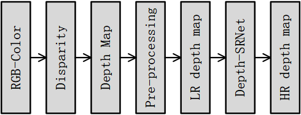
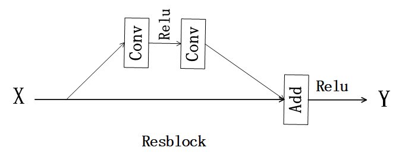
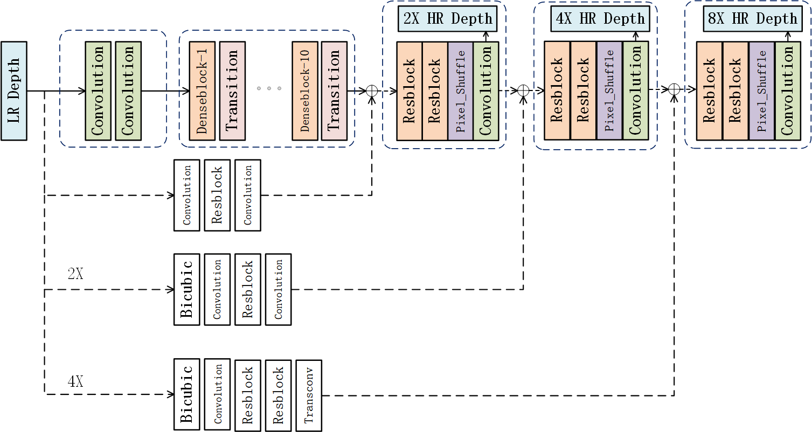
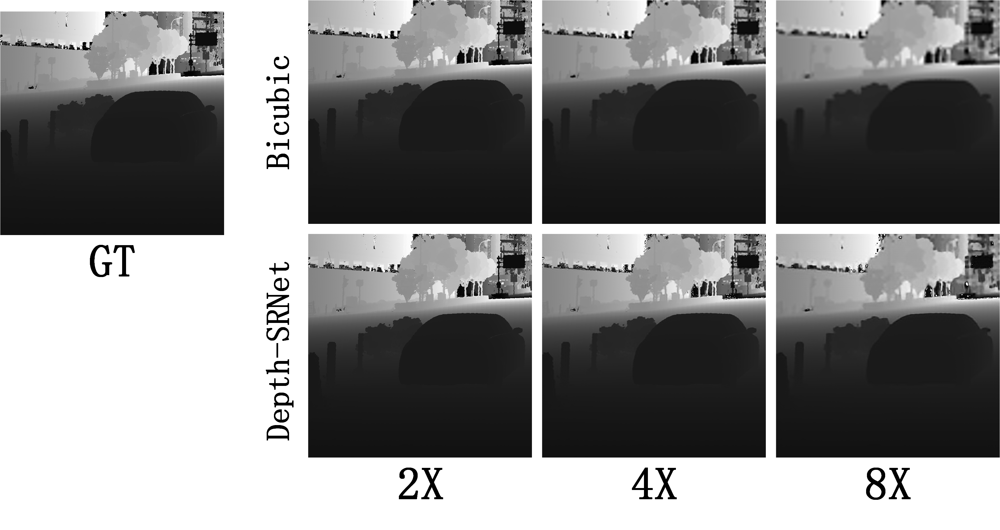
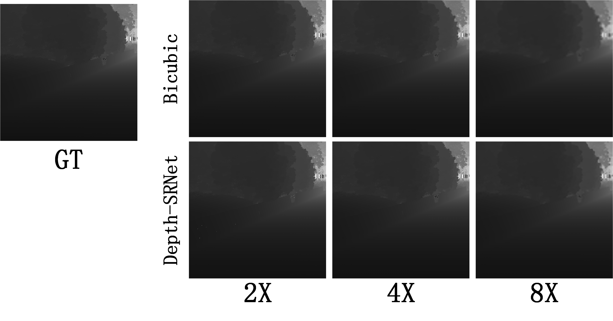

# Super-Resolution for Depth Map

> In order to solve the problems of low quality and lacked detail of low-resolution depth map acquired by camera, at the same time, the details recovered by neural networks model in super-resolution reconstruction task are more realistic than those recovered by traditional interpolation, Markov random field and other methods. This project proposes to build a deep neural networks model based on the idea of [densenet](https://github.com/liuzhuang13/DenseNet) and [resnet](https://github.com/KaimingHe/deep-residual-networks) for super-resolution reconstruction of depth map. Especially, the dense and residual connection networks are representative structures of neural network that play important roles in building the deep cnn model.

## Dependencies
+ pyTorch (1.4.0)
+ python (3.5.0+)
+ cuda-toolkit(9.0+)
+ torchvision (0.2.0+)
+ tensorboard (1.6.0)

## Data Pre-processing
The whole experimental steps include data pre-processing, cnn model training and test. Let's introduce the steps of data preprocessing here.  
  
&#160; &#160; &#160; &#160;The image database is composed of the original data randomly selected from the stereo matching data. All data were taken by the binocular camera, including the left and right RGB-color images. According to the stereo matching principle, the disparity map is calculated by using the left and right images, which represents the position and attitude relationship between the two cameras. Then, according to the parameters of binocular camera, the disparity map is transformed into depth map using conversion formula `depth=b*f/disp`, which `b` is camera baseline length, `f` is camera focal length and `disp` is disparity map. Super-resolution reconstruction of image is a process without optimal solution, because of different super-resolution algorithms are used to get different super-resolution results.  
&#160; &#160; &#160; &#160;Therefore, the present invention needs to simulate the image degradation process to build the experimental dataset: the trnsformed depth map from the disparity map conversion as the original HR depth map, and the low-resolution depth map can obtained by the degradation processing. The specific degradation process is as follows: all the original HR depth maps are cropped with the same size of image blocks to ensure that the area of interest retained after clipping covers the front scene of the image, and the depth map after clipping is processed by four times of down-sampling to get the LR (low resolution) depth map, and 3/4 of the data is randomly selected as the training set, the rest of the data As a test set. At this point, the data set preprocessing stage required by the invention is completed, each group of data includes LR depth map and its corresponding original HR depth map, which are used for subsequent model training and testing.

## Depth-SRNet

  

The proposed Depth-SRNet was mainly based on `resblock` and `denseblock`. We removed the `batch-normalization` layer, that only used `convolution` and activation function `Relu`. Our `Depth-SRNet` architecture as shown in the picture below：

We use a total of 10 `denseblock`, each of which is cascaded a `Transition` module to reduce the channel and computation. All up-sampling layers were used `Pixel_Shuffle` instead of using traditional deconvolution processing. We provide a multi-scale up-sampling strategy(2X, 4X and 8X), which can be matched freely according to the required up-sampling rate. Branch optimization modules provides global prior information of depth map, which contains `Bicubic`, `Resblock` and `convolution` layers. The `MSELoss` was used to supervise the model training.

## Results
In `results` directory, I give you two examples tested on depth map. I provide you `2X`, `4X` and `8X` results between `Depth-SRNet` and `bicubic` methods.  
  
  
Through the comparison of the results, we can find that the output of the `Depth-SRNet` are better than the interpolation method `bicubic`, and the restoration details are more realistic.

## Defects
At present, the main research object of neural network super-resolution reconstruction is color image. The end-to-end neural network model is constructed,ane then low-resolution color images are processed by feature extraction and up-sampling to get high-resolution color image outputs. At present, the neural network super-resolution reconstruction models for depth map are almostly improved from the RGB-color images super-resolution model, but the RGB images itself are richer than the texture, color and other features of depth map, and can use more image feature information, so it is difficult to mine more image features of depth map. When training the neural network model, we need to simulate the process of image degradation to build dataset first. The methods used in image degradation are not uniform. The neural network model can only adapt to the data set obtained by one or several degradation methods.

## Acknowledgement
This work is mainly inspired by [densenet](https://github.com/liuzhuang13/DenseNet), [resnet](https://github.com/KaimingHe/deep-residual-networks), [SRDenseNet](http://openaccess.thecvf.com/content_ICCV_2017/papers/Tong_Image_Super-Resolution_Using_ICCV_2017_paper.pdf), [EDSR](http://openaccess.thecvf.com/content_cvpr_2017_workshops/w12/papers/Lim_Enhanced_Deep_Residual_CVPR_2017_paper.pdf),
and [PASSRnet](http://openaccess.thecvf.com/content_CVPR_2019/papers/Wang_Learning_Parallax_Attention_for_Stereo_Image_Super-Resolution_CVPR_2019_paper.pdf).

